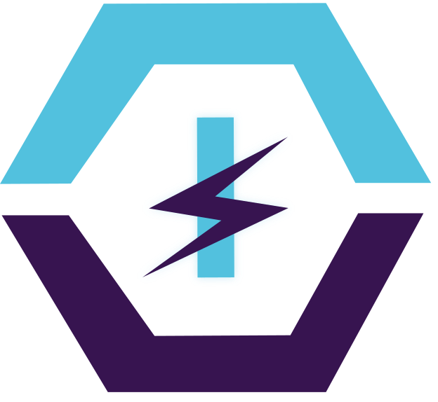

 <svg width="120" height="119" viewBox="0 0 942 940" fill="none" xmlns="http://www.w3.org/2000/svg">
    <path d="M160.688 474.784L258.023 474.436L382.759 651.014L579.863 650.308L676.565 472.938L772.684 472.594L630.041 732.106L318.568 733.221L160.688 474.784Z" fill="#371450"/>
    <path d="M382.879 257.038L261.775 430.004L159.529 430.37L309.531 169.249L630.875 168.1L781.525 428.145L673.193 428.532L583.719 256.32L382.879 257.038Z" fill="#52C1DE"/>
    <path d="M440.918 538.782L493.918 538.592L493.292 363.593L440.292 363.783L440.918 538.782Z" fill="#52C1DE"/>
    <path d="M578.204 363.289L408.699 453.258L493.612 452.954L578.524 452.651L489.515 438.075L578.204 363.289Z" fill="#371450"/>
    <path d="M400.919 538.925L578.524 452.651L493.612 452.954L408.699 453.258L497.708 467.833L400.919 538.925Z" fill="#371450"/>
</svg>

<!--  new version -->

 <svg width="624" height="565" viewBox="0 0 624 565" fill="none" xmlns="http://www.w3.org/2000/svg">
<path d="M285.83 398.211L338.83 398.021L338 166L285 166.19L285.83 398.211Z" fill="#52C1DE"/>
<path d="M215.51 298.034L320.118 315.47L206 398L417 297.453L311.203 280.598L416.406 194L413.434 195.743L215.51 298.034Z" fill="#371450"/>
<path d="M612.5 305L611 308L471.5 564.5L156 564.5L2.5 308L94 308L99.5 308L223.5 483L420 482L518 305L612.5 305Z" fill="#371450"/>
<path d="M514 261L623.5 261L471.5 -9.2317e-09L150 1L5.1396e-09 262.5L102.5 262L223.5 89L424.5 89L514 261Z" fill="#52C1DE"/>
</svg>

<!--  animated version -->
<svg width="624" height="565" viewBox="0 0 624 565" fill="none" xmlns="http://www.w3.org/2000/svg">
  <defs>
    <filter id="glow">
      <feGaussianBlur stdDeviation="8" result="blur"/>
      <feMerge><feMergeNode in="blur"/><feMergeNode in="SourceGraphic"/></feMerge>
    </filter>
  </defs>

  {/* <!-- Top hexagon --> */}
  <path d="M514 261L623.5 261L471.5 0L150 1L0 262.5L102.5 262L223.5 89L424.5 89L514 261Z" fill="#52C1DE">
    <animate attributeName="opacity" values="0;0;1;1;0;0" keyTimes="0;0;0.14;0.9;0.95;1" dur="5s" repeatCount="indefinite"/>
    <animateTransform attributeName="transform" type="translate"
      values="0,-40;0,-40;0,0;0,0;0,-40;0,-40"
      keyTimes="0;0;0.14;0.9;0.95;1"
      dur="5s" repeatCount="indefinite"
      calcMode="spline" keySplines="0 0 0 0;0.22 1 0.36 1;0 0 0 0;0.5 0 1 0.5;0 0 0 0"/>
  </path>

  {/* <!-- Bottom hexagon --> */}
  <path d="M612.5 305L611 308L471.5 564.5L156 564.5L2.5 308L94 308L99.5 308L223.5 483L420 482L518 305L612.5 305Z" fill="#371450">
    <animate attributeName="opacity" values="0;0;1;1;0;0" keyTimes="0;0.03;0.17;0.9;0.95;1" dur="5s" repeatCount="indefinite"/>
    <animateTransform attributeName="transform" type="translate"
      values="0,40;0,40;0,0;0,0;0,40;0,40"
      keyTimes="0;0.03;0.17;0.9;0.95;1"
      dur="5s" repeatCount="indefinite"
      calcMode="spline" keySplines="0 0 0 0;0.22 1 0.36 1;0 0 0 0;0.5 0 1 0.5;0 0 0 0"/>
  </path>

  {/* <!-- Glow pulse behind bolt --> */}
  <path d="M285.83 398.211L338.83 398.021L338 166L285 166.19L285.83 398.211Z" fill="#52C1DE" filter="url(#glow)">
    <animate attributeName="opacity" values="0;0;0;0.4;0.15;0.4;0.15;0.4;0;0" keyTimes="0;0.13;0.28;0.35;0.45;0.55;0.65;0.75;0.9;1" dur="5s" repeatCount="indefinite"/>
  </path>

  {/* <!-- Bolt vertical bar --> */}
  <path d="M285.83 398.211L338.83 398.021L338 166L285 166.19L285.83 398.211Z" fill="#52C1DE">
    <animate attributeName="opacity" values="0;0;0;1;1;0;0" keyTimes="0;0;0.13;0.16;0.9;0.95;1" dur="5s" repeatCount="indefinite"/>
  </path>

  {/* <!-- Lightning S shape --> */}
  <path d="M215.51 298.034L320.118 315.47L206 398L417 297.453L311.203 280.598L416.406 194L413.434 195.743L215.51 298.034Z" fill="#371450">
    <animate attributeName="opacity" values="0;0;0;1;1;0;0" keyTimes="0;0;0.16;0.2;0.9;0.95;1" dur="5s" repeatCount="indefinite"/>
  </path>

  {/* <!-- White flash burst --> */}
  <ellipse cx="312" cy="282" fill="white">
    <animate attributeName="rx" values="0;0;5;90;90" keyTimes="0;0.2;0.2;0.3;1" dur="5s" repeatCount="indefinite"/>
    <animate attributeName="ry" values="0;0;5;90;90" keyTimes="0;0.2;0.2;0.3;1" dur="5s" repeatCount="indefinite"/>
    <animate attributeName="opacity" values="0;0;0.5;0;0" keyTimes="0;0.2;0.22;0.3;1" dur="5s" repeatCount="indefinite"/>
  </ellipse>

  {/* <!-- Spark top-left --> */}
  <line stroke="#52C1DE" stroke-width="2.5" stroke-linecap="round">
    <animate attributeName="x1" values="270;270;270;270;270" keyTimes="0;0.21;0.21;0.31;1" dur="5s" repeatCount="indefinite"/>
    <animate attributeName="y1" values="210;210;210;210;210" keyTimes="0;0.21;0.21;0.31;1" dur="5s" repeatCount="indefinite"/>
    <animate attributeName="x2" values="270;270;270;235;235" keyTimes="0;0.21;0.21;0.31;1" dur="5s" repeatCount="indefinite"/>
    <animate attributeName="y2" values="210;210;210;170;170" keyTimes="0;0.21;0.21;0.31;1" dur="5s" repeatCount="indefinite"/>
    <animate attributeName="opacity" values="0;0;1;0;0" keyTimes="0;0.21;0.22;0.31;1" dur="5s" repeatCount="indefinite"/>
  </line>

  {/* <!-- Spark top-right --> */}
  <line stroke="#52C1DE" stroke-width="2.5" stroke-linecap="round">
    <animate attributeName="x1" values="350;350;350;350;350" keyTimes="0;0.22;0.22;0.32;1" dur="5s" repeatCount="indefinite"/>
    <animate attributeName="y1" values="210;210;210;210;210" keyTimes="0;0.22;0.22;0.32;1" dur="5s" repeatCount="indefinite"/>
    <animate attributeName="x2" values="350;350;350;390;390" keyTimes="0;0.22;0.22;0.32;1" dur="5s" repeatCount="indefinite"/>
    <animate attributeName="y2" values="210;210;210;170;170" keyTimes="0;0.22;0.22;0.32;1" dur="5s" repeatCount="indefinite"/>
    <animate attributeName="opacity" values="0;0;1;0;0" keyTimes="0;0.22;0.23;0.32;1" dur="5s" repeatCount="indefinite"/>
  </line>

  {/* <!-- Spark bottom-left --> */}
  <line stroke="#52C1DE" stroke-width="2" stroke-linecap="round">
    <animate attributeName="x1" values="255;255;255;255;255" keyTimes="0;0.215;0.215;0.315;1" dur="5s" repeatCount="indefinite"/>
    <animate attributeName="y1" values="340;340;340;340;340" keyTimes="0;0.215;0.215;0.315;1" dur="5s" repeatCount="indefinite"/>
    <animate attributeName="x2" values="255;255;255;215;215" keyTimes="0;0.215;0.215;0.315;1" dur="5s" repeatCount="indefinite"/>
    <animate attributeName="y2" values="340;340;340;375;375" keyTimes="0;0.215;0.215;0.315;1" dur="5s" repeatCount="indefinite"/>
    <animate attributeName="opacity" values="0;0;1;0;0" keyTimes="0;0.215;0.225;0.315;1" dur="5s" repeatCount="indefinite"/>
  </line>

  {/* <!-- Spark bottom-right --> */}
  <line stroke="#52C1DE" stroke-width="2" stroke-linecap="round">
    <animate attributeName="x1" values="365;365;365;365;365" keyTimes="0;0.225;0.225;0.325;1" dur="5s" repeatCount="indefinite"/>
    <animate attributeName="y1" values="340;340;340;340;340" keyTimes="0;0.225;0.225;0.325;1" dur="5s" repeatCount="indefinite"/>
    <animate attributeName="x2" values="365;365;365;405;405" keyTimes="0;0.225;0.225;0.325;1" dur="5s" repeatCount="indefinite"/>
    <animate attributeName="y2" values="340;340;340;375;375" keyTimes="0;0.225;0.225;0.325;1" dur="5s" repeatCount="indefinite"/>
    <animate attributeName="opacity" values="0;0;1;0;0" keyTimes="0;0.225;0.235;0.325;1" dur="5s" repeatCount="indefinite"/>
  </line>

</svg>